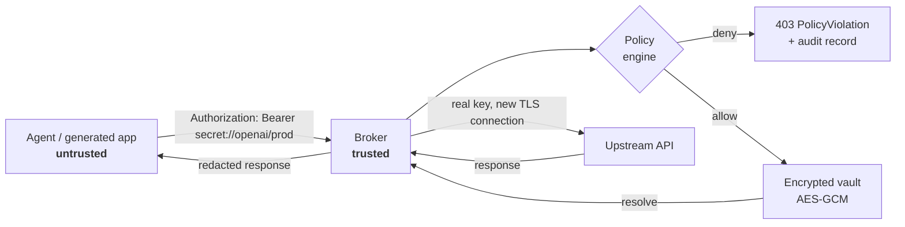

# Interpose

**Credential interposition for untrusted AI agents.**

[](https://github.com/Coelhomicka/interpose/actions/workflows/ci.yml)
[](LICENSE)
[](https://www.python.org/downloads/)
[](#project-status)

Coding agents write `.env` files, run shell commands, and paste config into prompts. Every one of
those is a place a real API key can end up. Interpose removes the key from the agent's reach
entirely: the agent gets an opaque reference, and a trusted local broker performs the authenticated
request on its behalf.

```dotenv
# what the agent sees, writes, and can leak
OPENAI_API_KEY=secret://openai/prod
OPENAI_BASE_URL=http://127.0.0.1:9876/proxy/api.openai.com/v1
```

The agent's HTTP client works unmodified. The plaintext key never enters the agent's process,
environment, arguments, logs, or context window.

The name is the mechanism. *Interposition* is the practice of inserting a trusted layer between a
caller and the resource it is reaching for — so the call still works, and the caller never holds
what makes it work.

---

## How it works



The order matters: **policy is evaluated before the secret is resolved.** A request to a destination
the policy does not allow is denied while the value is still encrypted at rest.

## Install

```bash
python -m venv .venv
source .venv/bin/activate       # Windows: .\.venv\Scripts\Activate.ps1
python -m pip install -e ".[dev]"
```

Runtime state lives in `~/.interpose` (`%USERPROFILE%\.interpose` on Windows). Keep the
administrative shell, the database, and the master key outside the agent's workspace.

## Quickstart

**1. Store a secret** through a hidden prompt — the value is never echoed or passed as an argument:

```bash
interpose secret add openai/prod
interpose secret list
```

**2. Grant a capability.** Policies come from an operator-controlled file. A session profile can
never grant one, so an agent cannot authorize itself by editing a project file:

```yaml
# openai-policy.yaml
secret: openai/prod

allow:
  hosts:
    - api.openai.com

methods:
  - GET
  - POST
```

```bash
interpose policy add openai-policy.yaml
interpose policy list
```

**3. Declare the session.** The profile binds conventional variable names to references:

```yaml
# session.yaml
version: 1

environment:
  OPENAI_API_KEY: secret://openai/prod

public_environment:
  OPENAI_BASE_URL: http://127.0.0.1:9876/proxy/api.openai.com/v1
```

**4. Start the broker** in a trusted terminal:

```bash
interpose proxy --host 127.0.0.1 --port 9876
```

**5. Run the agent** with a sanitized environment:

```bash
interpose run --profile session.yaml --agent claude-code -- claude
```

The child process receives `OPENAI_API_KEY=secret://openai/prod`. Credentials inherited from your
own shell are stripped — the environment is rebuilt from an allowlist — and the launcher never
passes `INTERPOSE_MASTER_KEY` or `INTERPOSE_HOME` to the child.

The launcher is agent-agnostic:

```bash
interpose run --profile session.yaml --agent codex      -- codex
interpose run --profile session.yaml --agent cursor     -- cursor
interpose run --profile session.yaml --agent gemini-cli -- gemini
```

## Verifying without resolving

Every validation path works on references alone. None of them decrypt anything:

```bash
interpose profile validate session.yaml
interpose profile env session.yaml
interpose env validate .env --profile session.yaml    # check what the agent wrote
```

`env validate` guards against the most common failure mode: an agent that "helpfully" replaces a
reference with a plaintext value, a `****` placeholder, or an invented token.

## Telling the agent the rules

[`docs/AGENT_CREDENTIALS.md`](docs/AGENT_CREDENTIALS.md) is a drop-in contract for the agent's own
instruction file (`CLAUDE.md`, `AGENTS.md`, `GEMINI.md`, Cursor rules). It states the expected
behavior: use references normally, never resolve them, never substitute a fake value, never rewrite
`/proxy/{allowed-host}` to dodge policy, and report a `PolicyViolation` instead of working around it.

## Transport support

| Transport | Status |
| --- | --- |
| Explicit local transport `http://127.0.0.1:9876/proxy/{host}/{path}` | Implemented — recommended |
| External TLS origination (broker opens its own HTTPS connection) | Implemented |
| Scheme-aware policy (insecure external HTTP denied by default) | Implemented |
| Query, form, JSON body, and header substitution | Implemented |
| HTTP forward proxy via `HTTP_PROXY` | Compatibility only |
| HTTPS `CONNECT` | **Deliberately rejected** |
| Transparent HTTPS interception | Not implemented — needs a session CA and pinning handling |
| Database auth, SSH, mTLS, SigV4 signing | Not implemented — needs protocol-level brokers |

`CONNECT` returns `501` rather than silently tunneling. A broker that cannot see the request cannot
enforce policy on it, and pretending otherwise would be a false guarantee.

## Project status

**Alpha.** The reference model, policy engine, broker, and audit trail work and are covered by
tests. The isolation story is not finished, and that gap is the difference between *policy
enforcement* and *adversarial containment*.

Guaranteed today:

- no API or CLI operation returns a stored secret value;
- policy is evaluated before resolution;
- managed child environments contain references, not values;
- storage uses AES-GCM authenticated encryption;
- responses are redacted for known resolved values;
- audit records hold references and metadata only.

**Not** guaranteed yet:

- **isolation from another process running as the same OS user** — a same-user process can read the
  vault file and the master key. Until the broker runs under a separate OS identity, this is the
  binding limitation;
- **denial of direct network egress** — nothing stops an agent from opening its own socket and
  bypassing the broker. OS-level egress control is mandatory for a real threat model;
- protection against process-memory, DNS, or covert-channel attacks;
- compatibility with SDKs that validate token *format* locally before any request is made.

[`docs/THREAT_MODEL.md`](docs/THREAT_MODEL.md) has the full per-threat breakdown. It is written to
be honest about what does not work, not to market what does.

## Platform support

| | Core (vault, policy, broker, CLI, audit) | AppContainer isolation |
| --- | --- | --- |
| Windows | Supported | Supported (elevated shell required) |
| Linux | Supported | Not implemented — see [roadmap](docs/ROADMAP.md) |
| macOS | Supported | Not implemented — see [roadmap](docs/ROADMAP.md) |

## Limited executor

`interpose-exec` substitutes secrets directly into subprocess arguments:

```bash
interpose-exec --agent codex curl "https://api.github.com/user" \
  -H "Authorization: Bearer secret://github/prod"
```

The subprocess therefore **possesses** the plaintext. This mode exists for compatibility with tools
the broker cannot mediate; it is not suitable for arbitrary or agent-generated executables. Prefer
the broker, where the secret never enters the child process.

## Administrative API

```bash
interpose api --host 127.0.0.1 --port 8000
```

`GET /health` · `GET|POST /secrets` · `DELETE /secrets/{id}` · `GET|POST /policies` · `GET /audit`

No endpoint returns a secret value. The API has no authentication yet, so it must stay on loopback,
in a trusted session, outside the agent's reach.

## Documentation

- [Architecture](docs/ARCHITECTURE.md) — components, request lifecycle, trust boundary
- [Threat Model](docs/THREAT_MODEL.md) — per-threat status, guarantees and non-guarantees
- [Agent Credential Contract](docs/AGENT_CREDENTIALS.md) — the rules to give the agent
- [Roadmap](docs/ROADMAP.md) — V2 enforced isolation through V5 agent integrations

## Contributing

Contributions are welcome — see [CONTRIBUTING.md](CONTRIBUTING.md). The work that moves the project
furthest right now is listed there, starting with running the broker under a separate OS identity.

To report a security vulnerability, follow [SECURITY.md](SECURITY.md) rather than opening a public
issue.

## License

Apache License 2.0 — see [LICENSE](LICENSE).
