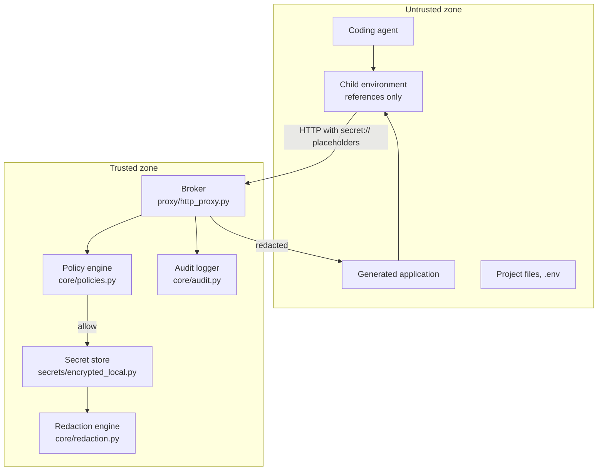

# Architecture

This document describes how Secret Runtime is put together and, more importantly, *where the trust
boundary sits*. Contributions that move that boundary need an issue first — see
[CONTRIBUTING.md](../CONTRIBUTING.md).

## The core idea

Conventional secret managers answer the question "what is the value of this credential?" That
question is unanswerable safely when the caller is an AI agent, because the answer immediately
becomes part of a filesystem, a process environment, a log, and a context window.

Secret Runtime never answers it. It answers a different question: *"perform this operation, which
happens to require a credential."* The untrusted side holds a reference; the trusted side holds the
value and performs the operation.

## Trust boundary

Everything in the untrusted zone is assumed hostile: the agent may be prompt-injected, the generated
code may be malicious, and project files may have been written by either.

The launcher (`session/launcher.py`) is the gate between the two. It builds the child environment
from an allowlist rather than inheriting the parent's, so credentials already present in the
operator's shell do not cross into the agent session, and it never passes
`SECRET_RUNTIME_MASTER_KEY` or `SECRET_RUNTIME_HOME` to the child.

> **Current limitation.** The broker runs as the same OS user as the agent. A malicious same-user
> process can read the vault file and master key directly instead of going through the broker at
> all. Until the broker runs under a separate OS identity, the diagram above describes a *policy
> boundary*, not an *enforcement boundary*. This is the top item on the
> [roadmap](ROADMAP.md) and in [CONTRIBUTING.md](../CONTRIBUTING.md).

## Components

| Module | Responsibility |
| --- | --- |
| `core/references.py` | Parse and normalize `secret://provider/namespace/path`; discover references nested in arbitrary payloads |
| `core/policies.py` | Policy documents, SQLite-backed repository, and the engine that decides allow/deny |
| `core/substitution.py` | Replace references with resolved values across strings, mappings, and sequences |
| `core/redaction.py` | Register resolved values and strip them from responses, headers, and error text |
| `core/audit.py` | Append-only SQLite record of references, destinations, decisions, and timings — never values |
| `secrets/base.py` | The `SecretStore` protocol; the seam for external stores |
| `secrets/encrypted_local.py` | AES-GCM vault with per-record nonces and value fingerprints |
| `proxy/http_proxy.py` | The broker: target parsing, policy check, resolution, upstream request, redaction |
| `executor/trusted_executor.py` | `secure-exec` compatibility mode — substitutes into subprocess arguments |
| `session/profile.py` | Session profile parsing and validation; enforces that profiles cannot grant policy |
| `session/launcher.py` | Environment allowlist construction and child process launch |
| `session/isolation/` | OS-level isolation backends behind the `IsolationBackend` protocol |
| `api/app.py` | Administrative FastAPI app; no endpoint returns a value |
| `cli/main.py` | The `secretruntime` and `secure-exec` entry points |
| `container.py` | Composition root — wires every component from `RuntimeConfig` |

`create_container()` is the single place where dependencies are assembled. Tests build their own
container against a temporary runtime home rather than patching globals.

## Request lifecycle

The broker's path for a single request, in order — the order *is* the security property:

1. **Reject `CONNECT`.** Returns `501`. An opaque TLS tunnel cannot be inspected, so policy cannot
   be enforced on it and no guarantee is claimed.
2. **Parse the destination.** `parse_local_transport_target()` derives the upstream authority from
   `/proxy/{host}/{path}`. Loopback destinations default to `http`; everything else defaults to
   `https`. Embedded credentials in the authority are rejected.
3. **Discover references.** `collect_secret_references()` walks headers, query pairs, and the body —
   decoding JSON and form encodings first, so a reference hidden inside a URL-encoded parameter is
   still found.
4. **Evaluate policy — before resolution.** Every discovered reference is checked against its policy
   for scheme, method, and destination host. Any denial returns `403`, writes an audit record, and
   the secret is never decrypted.
5. **Resolve and substitute.** Only now does the vault decrypt. Values are substituted into headers,
   query parameters, and the body according to content type, then re-encoded safely.
6. **Register for redaction.** Every resolved value is added to the redaction engine before the
   upstream call, so it can be caught in a response or an error trace.
7. **Call upstream.** A new connection with `follow_redirects=False` and `trust_env=False`, so the
   broker does not follow a redirect to an unvetted host or inherit proxy settings from the
   environment.
8. **Redact the response.** Headers and body are scrubbed of known resolved values. Hop-by-hop
   headers are dropped.
9. **Audit.** Reference, destination, method, decision, upstream status, and duration are recorded.
   The resolved URL is redacted before it is persisted.

## Data model

**References** are `secret://provider/namespace/path`, normalized to lowercase canonical form.
Shorthand like `APIChave/teste` normalizes to `secret://apichave/teste`.

**Storage.** Each record holds the AES-GCM ciphertext, its nonce, and a SHA-256 fingerprint of the
plaintext. The fingerprint supports equality checks and audit correlation without retaining the
value.

**Master key.** Read from `SECRET_RUNTIME_MASTER_KEY` when set, otherwise from `master.key` in the
runtime home, generated with `os.urandom(32)` on first use. Either source is passed through SHA-256
to produce the 32-byte key. The file currently relies on OS user permissions — the same-user
limitation above applies directly here.

**Policies** are stored one per secret reference, keyed uniquely. Adding a policy for an existing
reference replaces it. A reference with no policy is denied: the default is closed.

**Audit records** are append-only and contain a reference, destination, action, decision, status,
duration, and a JSON details blob. Values never enter this table.

## Extension points

Three protocols are the intended seams for contributions:

- **`SecretStore`** (`secrets/base.py`) — implement `store`, `resolve`, `list`, `delete` to back the
  runtime with Vault, a cloud secret manager, or an OS keychain.
- **`IsolationBackend`** (`session/isolation/base.py`) — implement `run(command, environment, cwd)`
  for a platform. `windows_appcontainer.py` is the reference implementation; it derives a container
  SID, applies ACLs, and installs firewall rules scoped to that SID so the child can reach the
  broker port and nothing else on loopback.
- **Protocol brokers** — the HTTP broker is one instance of a general shape: accept an operation
  containing references, check policy, resolve inside the trusted zone, perform the operation,
  return a redacted result. Database authentication, SigV4 signing, SSH, and mTLS all fit this shape
  and none of them require handing key material out.

## Design decisions worth knowing

**Policy is never sourced from the agent's workspace.** Session profiles bind names to references
but cannot grant capabilities. If a profile could grant policy, an agent that can write project
files could authorize itself — which would make the entire policy engine decorative.

**`CONNECT` fails loudly.** Silently tunneling would produce working software with a false security
claim. A `501` is a worse user experience and an honest one.

**Redaction is exact-match, and that is a known limit.** The engine strips known resolved values from
responses. A value that is transformed — re-encoded, hashed, split across a boundary — can evade it.
Redaction is a safety net for accidental reflection, not a defense against a determined exfiltrator.

**Insecure external HTTP is denied by default.** Sending a resolved credential over plaintext HTTP to
a non-loopback host requires an explicit `schemes: [http]` in the policy.
